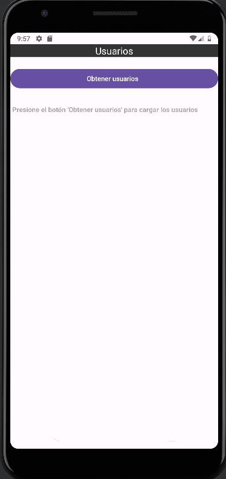
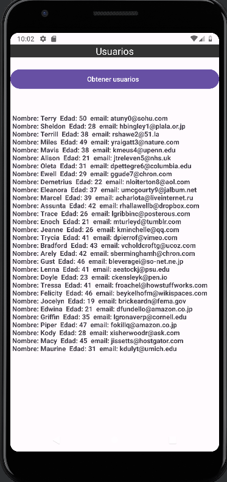

# Consumir-una-API-RESTful-enformato-JSON-en-Android
***

Implementar una aplicación nativa Android que muestre la información de una API RESTful en formato JSON  https://dummyjson.com/users
Puede usar cualquiera de las 3 librerías vista en clases: Google Volley, HttpRequest o Retrofit

## Pantalla de inicio
***

Se colocado dentro de la pantalla de inicio un botón que pueda cargar los usuarios.

## Listado de los usuario de la API mencionada
***

